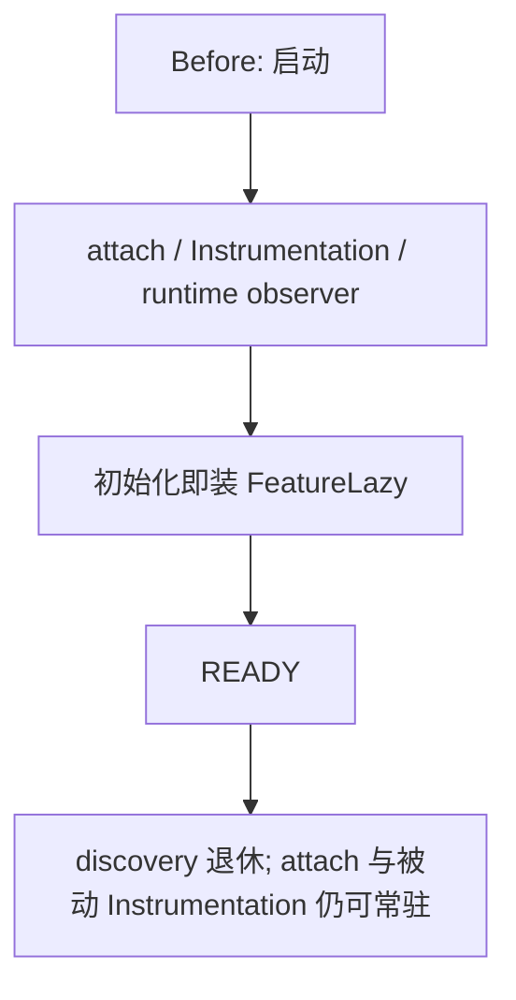
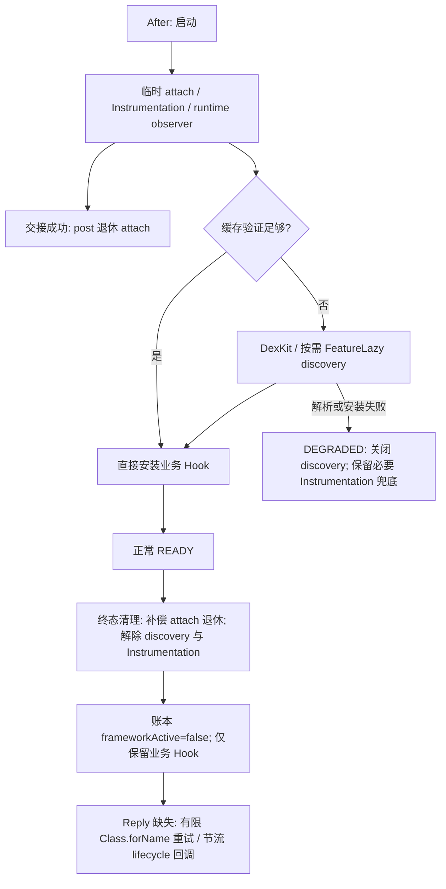

# Issue #5 — Mode A-ZF 整改与自主验收报告

日期：2026-08-27（Asia/Shanghai）。状态：本地开发验收完成，等待人工验收；未发布、未 push。

## 1. 结论、范围与改动摘要

```text
ZERO_FRAMEWORK_AFTER_READY = YES
```

**上述 YES 限定于本报告实测的酷安 16.6.1、默认三项配置、正常 READY 清理完成后的模块 Hook 状态。** 最终 APK 的三次缓存命中启动和一次缓存重建启动均满足 `missingRequired=[]`、`frameworkActive=false`、`frameworkActiveHooks=[]`。这不是对所有宿主版本、所有选项或 unhook 失败情形的无条件保证，也不是“服务端风控已经解决”的证明。

源码基准：`c741d054aeba86c12ac4f47ef27a0b10a69643c7`。交接检查点为 `e03d2eb3652a90c2d929ae68232f9f5e53c6c077`，两者之间新增一次源码修复提交。报告和 README 的后续文档提交不改变这份已验收 APK。

继承的 Mode A / A-ZF 改动：

- 移除 `shouldShowAd` 决策层 Hook、Settings 的五个 framework Hook 和 `LayoutInflater.inflate` / `View.setTag` 回退。
- `Application.attach` 在成功交接后一次性退休；READY 的终态清理补偿被 Handler 清队列取消的退休任务。
- 正常 READY 在专用 Splash Hook 安装成功后真正解除两个 Instrumentation Hook；DEGRADED 保留安全兜底。
- Reply discovery 改为先尝试缓存和直接加载，必要时在适配窗口内安装两个 FeatureLazy Hook，终态永久关闭 discovery。
- 增加 HookLedger、退休策略、有限次数的 Reply 重试和节流的 Android 生命周期回调；未新增长期 framework Hook。

本次接手补充：

1. boot8 实机确认交接中的 attach 竞态修复有效。
2. 发现终态调用 `retireApplicationAttachNow()` 绕过交接前提的失败路径。新增回归测试先复现失败，再在真实退休入口重查 context/config/settings lifecycle；未满足时保留 Hook，也不消耗一次性退休状态。
3. 串行化两个退休调用，避免终态账本越过仍在执行的 unhook；生命周期注册标记改为 `volatile`，供 resolver worker 读取。
4. unhook 失败不再打印 `attachHookRetired=true`。Instrumentation 已解除时，不再把未解析的历史 Splash 类误报为 `passive` 覆盖，而明确打印 `uncovered`。
5. 完成最终 APK 的构建、签名/安装哈希检查、缓存命中/重建实测和设置入口抽查。

## 2. Before / After Hook 生命周期

Before 指 Mode A 完成、A-ZF 开始前的实现，不是最初发布版本。





`state=READY` 的状态提交早于 cleanup 数毫秒；本报告的“READY 后零 Hook”指终态 cleanup/ledger 完成时，不将状态写入与 framework unhook 冒充为同一个原子操作。

## 3. HookLedger 与记录边界

账本按 id 记录 `layer / owner / target / installedAt / retiredAt / retireReason`，以是否已有退休时间判断 active。framework 与 business 分层；成功退休才关闭记录，失败句柄保留。

最终正常 READY 的活跃业务记录：

```text
feed-filter-179e11df
feed-filter-91178bb9
splash-specific-com.coolapk.market.view.splash.SplashAdActivity
```

账本用于记录本模块通过 framework API 安装及解除 Hook 的结果，不是 ART 全局独立扫描，也不覆盖其他模块或 Frida 的 Hook。部分 Instrumentation/observer unhook 失败时，当前分组记录可能保守地保留同组 id；不能凭分组 id 推断每一个 overload 都仍活跃，须同时看 `remaining`、`failed` 和 registry 状态。

本次没有向酷安注入 Frida。五个 MCP 均做了只读可用性确认；IDA/MT 仅初始化及列工具，没有切换文件、修改 APK 或继续安全 SDK 逆向。

## 4. Framework Hook Before / After 表

| Hook | Mode A 时的生命周期 | A-ZF 正常路径 | 失败 / DEGRADED |
| --- | --- | --- | --- |
| `Application.attach(Context)` | 可持续保留 | 成功交接后退休；终态补偿取消的 post | 交接条件不满足时保留并记录原因；unhook 失败保留句柄 |
| `Instrumentation.callActivityOnCreate(Activity, Bundle)` | READY 后被动常驻 | 专用 Splash 就绪且 READY 时解除 | DEGRADED 或专用目标不满足时保留 |
| `Instrumentation.callActivityOnCreate(Activity, Bundle, PersistableBundle)` | 同上 | 同上 | 同上 |
| RuntimeDexObserver `loadClass(String)` | 临时观察器 | 发现业务 loader 后关闭，适配期间必要时重装，终态关闭 | 解除失败时逻辑停用并报告残留 |
| RuntimeDexObserver `loadClass(String, boolean)` | 同上 | 同上 | 同上 |
| FeatureLazy `loadClass(String)` | 配置初始化阶段安装 | 缓存/直装不足时才安装，收敛或终态退休 | 终态不重装，失败保留 inert 句柄 |
| FeatureLazy `loadClass(String, boolean)` | 同上 | 同上 | 同上 |
| Settings framework Hooks ×5 | Mode A 已删除 | 继续使用 `ActivityLifecycleCallbacks` | 不恢复 framework Hook |
| `LayoutInflater.inflate` / `View.setTag` | Mode A 已删除 | 保持删除 | 不恢复 |

Phase 4 保留当前临时 RuntimeDexObserver：受加固分阶段追加 DEX 影响，需要先确定业务 loader，未为了“启动时也零 Hook”跳过观察器。本阶段要求的是正常 READY 清理完成后零 framework Hook。

## 5. 业务不变量及不能混淆的覆盖范围

- Feed：继续先完整调用 `chain.proceed()`，只过滤返回的 List；异常保留原列表。不改 response/cursor/page/impression/network request。
- Splash：只在 Activity 展示边界处理；没有恢复 `shouldShowAd`、PRE_BLOCK 或 AFTER_OVERRIDE。专用业务 Hook 的过滤逻辑未因本次接手而改变。
- Settings：Android lifecycle 注册和原有设置注入；最终包实机可进入“酷安净化”，八个开关为前三项开启、其余关闭。退出后日志记录页面状态释放，未改变用户设置。
- Issue #2：保留现有数据层业务过滤与语义 gate，不恢复布局 framework 回退。本次五个可选项均关闭，未对每项进行新的实机回归。
- Security/network：没有修改 NetHT、metasec、nuid、X-App-Device、token、ddid、remote config、package visibility 或服务端请求。

**Reply 限制：** 最终设备日志仍为 `ClassNotFoundException / installed=false`，当前 loader 无法直接加载 `MultiFeedReplyViewHolder`。交接材料根据历史日志将其判断为 16.6.1 原有可达性问题；本轮再次确认不可达，但未重新证明其具体 DEX 成因。专用 Reply Hook 不计入当前 core READY 所需项，因此 `missingRequired=[]` 不代表所有默认选项已完整生效。

**Splash 限制：** 当前只安装 `SplashAdActivity.onCreate`。`FullScreenAdActivity` 和 `SplashActivity` 未获得独立专用覆盖，Instrumentation 解除后准确标记为 `uncovered`。未实测这些 Activity 的所有可能启动路径；零 framework 指标不能证明这些路径全部无广告。

## 6. 单元测试与验证方法

使用 JDK 17.0.20.8，运行 `gradlew.bat test assembleRelease`。接手时对原有三个测试变体执行 `--rerun-tasks`，各 198 项通过；补充三个真实 coordinator 退休入口测试后，各 201 项通过：

| 变体 | Tests | Failures | Errors | Skipped |
| --- | ---: | ---: | ---: | ---: |
| Debug | 201 | 0 | 0 | 0 |
| Compatible | 201 | 0 | 0 | 0 |
| Release | 201 | 0 | 0 | 0 |

这是 201 个测试在三个变体中执行，不是 603 个不同测试。

新增测试在已有 `AttachHandoffPolicyTest` 中，使用模拟 HookHandle 调用 coordinator 的实际退休入口：

1. `terminalCleanupCannotBypassFailedLifecycleHandoff`：交接失败不能 unhook；前提补齐后仍可退休。修复前红、修复后绿。
2. `terminalCleanupRetiresCancelledPostAndLatePostIsIdempotent`：post 未执行时终态完成一次退休；迟到 post 不重复 unhook。
3. `failedUnhookRemainsInLedgerAndRetainsHandle`：unhook 抛错后账本保持 active，句柄不丢失。

已有策略/单测覆盖 attach 前提、Instrumentation READY/DEGRADED 分支、Reply cache 门控、lazy 生命周期、retry 次数以及 Feed 过滤等。策略单测不等于真实 LSPosed 故障注入；本轮没有在手机上人为制造 framework unhook 失败或 DEGRADED。

## 7. Release build / hash / 安装

| 项目 | 结果 |
| --- | --- |
| 源码提交 | `c741d054aeba86c12ac4f47ef27a0b10a69643c7` |
| 模块版本 | 2.2.0 / versionCode 10（本地候选，未发布） |
| APK | `app/build/outputs/apk/release/app-release.apk` |
| 大小 | 1,128,065 bytes |
| SHA-256 | `EEA859211DA484910C2D202362D0E1B0E7241B4D0D3F6F128154199BEA35012C` |
| 签名 | apksigner verify 通过；v2=true；signers=1 |
| signer certificate SHA-256 | `12B482270B217A377CF3881382C86EE9F1C3E2B8E4BE25EE5118F327F2858875` |

安装方式：先 push 到 `/data/local/tmp/processing/coolapk-purifier-azf-final.apk`，再执行 root `pm install -r -t --user 0`，返回 `Success`。已安装 `base.apk`、手机 staging APK、本机 Release APK 的 SHA-256 三者相同。

已安装路径：

```text
/data/app/~~B5Vu1h55SP7ME5BDtP8xzQ==/io.github.yylsping.coolapkpurifier-blanrK-93ZdBppl_YOGTGA==/base.apk
```

交接包 azf7 的哈希为 `2EB46F8B461A2F59949065868B16F3985722F777ABD9F6D214DE15032711E75F`，大小 1,127,677 bytes。boot8 验证该旧候选；boot9–12 验证本节最终候选，不能混用哈希。

## 8. 实机 READY 日志与 UI

设备：OnePlus PLQ110；酷安 16.6.1 (2608212)；root、LSPosed 已启用。ADB 当前为 `192.168.2.251:41725`。只通过强制停止并重开酷安验证，没有重启手机/LSP，没有改模块开关或作用域数据库。

| 轮次 | 候选 | 缓存路径 | READY / ledger 相对时间 | FeatureLazy 安装 / 退休 | frameworkActive |
| --- | --- | --- | --- | --- | --- |
| boot8 | 交接 azf7 | hit | 184 / 188 ms | 0 / 0 | false |
| boot9 | 最终候选 | hit | 187 / 188 ms | 0 / 0 | false |
| boot10 | 最终候选 | hit | 175 / 177 ms | 0 / 0 | false |
| boot11 | 最终候选 | miss，完整重建 | 727 / 729 ms | 2 / 2 | false |
| boot12 | 最终候选 | 恢复原缓存后 hit | 178 / 180 ms | 0 / 0 | false |

时间取自 bootstrap trace 的 `rel`；宿主有两个 attach 实例，trace 起点可能重置，不能把这些数值当成完整应用冷启动耗时。

boot12 trace 摘录：

```text
rel=   178ms evt=cacheHit               entries=7 dexkitScan=false
rel=   178ms evt=state                  READY
rel=   178ms evt=terminalSnapshot       terminalGeneration=1 terminalLoaderIdentity=143723653 terminal=READY coreReady=true missingRequired=[] source=cache
rel=   179ms evt=attachHookRetired      reason=terminalCleanup:READY failed=0
rel=   180ms evt=hookLedger             hook ledger state=READY frameworkActive=false frameworkActiveHooks=[] businessActiveHooks=[feed-filter-179e11df, feed-filter-91178bb9, splash-specific-com.coolapk.market.view.splash.SplashAdActivity]
rel=   181ms evt=instrumentationSafety  retired=true active=false
```

同轮 LSPosed module log 的消息正文：

```text
coordinator attachHookRetired=true reason=terminalCleanup:READY unhooked=1 failed=0 remaining=0
feature lazy class resolver retired reason=terminal:READY handlesBefore=0 unhookedThisClose=0 failedThisClose=0 totalUnhooked=0 totalFailures=0 remaining=0 frameworkActive=false logicalEnabled=false permanent=true
instrumentation safety retired reason=terminal:READY unhooked=2 failed=0 remaining=0
resolver fullReady state=READY feedInstalled=2 splashSpecificInstalled=[com.coolapk.market.view.splash.SplashAdActivity] splashCoveredByLegacy=FullScreenAdActivity=uncovered|SplashActivity=uncovered|SplashAdActivity=specific coverageSettledBy=cache terminalGeneration=1 terminalLoaderIdentity=143723653
```

boot11 首次缓存重建的 trace 确认 `cacheMiss verified=0 total=0`、`bridgeCreateEnd dexNum=11`、`cacheSaved entries=7 coverageSettled=true`，终态 `featureLazyTotalUnhooked=2 featureLazyTotalFailures=0`、`runtimeWatcherTotalUnhooked=2 runtimeWatcherTotalFailures=0`。attach 走 `handoffComplete` 路径于 rel=327ms 退休，证明没有只验证快缓存的终态补偿分支。

缓存重建前，仅把本模块 `coolapk_purifier_cache_v4.json` 移到 processing 作备份；验证后恢复原字节，再跑 boot12。原缓存与恢复后的 SHA-256 同为 `1F556258186CBA0BDA507C7C9390DAB2E422BC79F9BB19C3363BD3E7AFC2AD7B`。用户配置前后均为 `8955EAD0BA2586DF1C729D0BC679E84812493B901BB3FF18EF0E7E72F09D35C6`。

最终包 UI：设置列表包含“酷安净化”；点击后八项开关正常；退出后有 `settings page state removed on destroy remaining=0`。本次未切换配置项。当前主进程 PID 13682 的 crash buffer 查询为空，抽查期间 UI 可正常操作。

Feed 两个业务 Hook 安装均有本轮证据。交接材料记录上一轮 `removed 3 filtered item(s)`；本轮短时浏览未获得新的广告删除正样本，不将“未看到广告”当作新的过滤行为证明。

## 9. DEGRADED fallback 与尚未验证事项

- `FrameworkRetirePolicy` 在 DEGRADED 下保留 Instrumentation，即使部分专用 Splash 已成功安装也不为了零指标强删兜底。
- discovery 在终态逻辑停用；framework 解除失败按实际句柄和日志显示，**该情形的 ZERO_FRAMEWORK 判定必须为 NO**，不能用 inert 冒充 unhook 成功。
- attach 交接失败时保留并记录 missing condition。本轮的修复保证终态入口不绕过这个前提；不承诺失败环境都能自动恢复。
- 当前 Reply 的持久缓存 key 机制存在，但最终缓存只有 7 个核心条目、没有 Reply target。三次核心 cache hit 的零 lazy 不是“真实 Reply cache hit 已验证”。可达版本上的 Reply 再发现、写回和下次直装尚需另外的实机覆盖。
- cache identity 复用包名、versionCode、APK/split 名称与大小、签名摘要；本阶段没有加入独立 runtime DEX 内容哈希。Reply 安装仍依赖既有语义类名与 bind shape，不是任意混淆变化下的通用发现器。
- Reply 的四次延迟重试结束后会退出专用线程；未成功时 Android lifecycle observer 继续保留，resume 尝试最短间隔 30s。它不是 Xposed framework Hook，也不是整个进程生命周期都零额外工作。
- 本轮只验证默认三项配置和当前 16.6.1；未重新测试旧版、多进程替换 loader、全部 Issue #2 选项、所有 Splash 路径或服务端风控正样本。

## 10. 证据索引、diff 与交付状态

主要本地证据目录：`.tmp_audit/azf_acceptance/`（原始日志、UI 和工具脚本不提交到仓库）。

| 文件 | 内容 |
| --- | --- |
| `acceptance_summary.json` | 源码提交、最终包哈希、三变体计数、四轮最终候选 trace 哈希 |
| `boot8_trace_full.log` | 交接 azf7 的修复验证，含旧轮次上下文 |
| `boot9_trace.log` / `boot10_trace.log` | 最终候选两次核心缓存命中 |
| `boot11_miss_trace.log` | 模块解析缓存重建，FeatureLazy 安装/退休 |
| `boot12_restored_trace.log` | 恢复原缓存后的第三次命中 |
| `boot*_modules*.log` | 配套 LSPosed 日志；可按 PID/时间关联 |
| `final_settings_ui.xml` / `final_config_ui.xml` / `final_config.png` | 最终包设置入口、八项配置页 |
| `final_ui_modules.log` / `final_crash.log` | UI 注入/释放和当前进程 crash 查询 |
| `attach_regression_before.log` | 修复前回归测试失败证据 |
| `unit_tests.log` / `final_build_tests.log` | 基线重新执行及最终构建测试 |
| `apksigner.txt` / `installed_sha256.txt` | 签名与已安装文件一致性 |
| `before_cache_miss_sha256.txt` / `restored_cache_sha256.txt` | 用户配置未改、解析缓存恢复一致 |

boot9 辅助脚本首次遇到 `pidof` 返回短暂多个 PID，在日志筛选步骤报错；原始新 trace 已保存。修正脚本为支持多个 PID 后，保留该轮原始证据，并继续独立的 boot10–12；没有把脚本中间失败当成模块失败或伪造重跑成功。

设备新建截图、UI XML、APK staging 和缓存备份均在 `/data/local/tmp/processing/`。应用自身正常写入的配置/缓存/trace 与 LSPosed 自身日志沿用其原生目录，读取时没有另建散落的手机调试副本。

本轮源码提交：`c741d05 Fix attach retirement preconditions and audit fallback coverage`，4 files changed，138 insertions，15 deletions。`git diff --check` 通过；在 `git diff --stat` 中核对范围，仅包含 coordinator 退休前提/诊断、Settings 注册标记、Splash 诊断与已有测试文件扩展。继承的未跟踪审计工件未删除、未批量暂存。

最终交付包括本报告、同步后的 README、上述本地源码提交和已经安装验证的 Release APK。**等待用户人工验收及明确的远程写入授权；没有创建或修改远程 commit、branch、tag、PR 或 release。**
